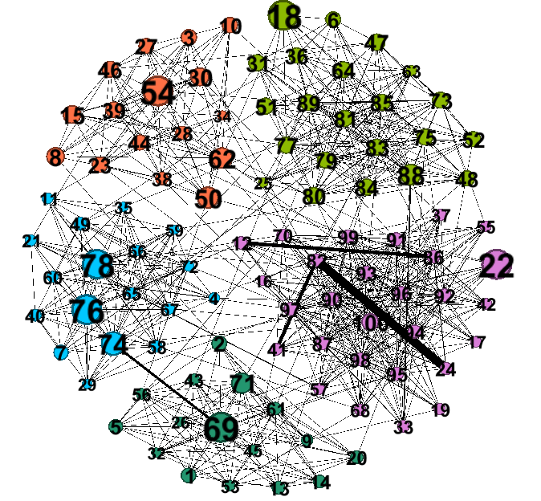

# Community

- [x] merging process 

- [x] restoring process

- [x] no-overlapping community based algorithm

- [ ] overlapping community based algorithm

- [ ] distributed set-cover algorithm

###Use case

    cd ./Test
    python test.py

Example

k = 8, n = 100

 

| Algorithm | $$ \tau(S,V)$$ |           $S$            |
| :-------: | :------------: | :----------------------: |
| Community |     3.959      | 18,76,69,100,22,12,17,33 |
|   Naive   |     6.538      |                          |